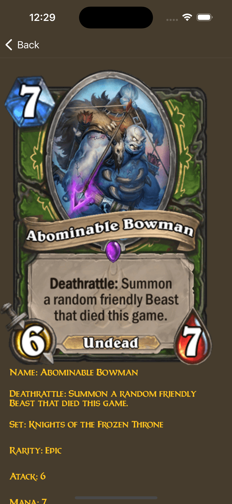

# Heart of Stones Viewer

Simples aplicação que lista cartas do jogo Heart Of Stone e permite vizualizar alguns detalhes ao seleciona-la.

O projeto consome a api da Blizzard, é necessário  registrar-se e criar um `Client app` para gerar o `ClientID` e o `ClientSecret`.

Para mais informações siga o link: [Blizzard Develop Access](https://develop.battle.net/access/clients/fd740fac011c405d8463225681bb6e86)

## Preview

### Modo Light e Dark aplicados: 
<p float="left">
<kbd></kbd>
<kbd></kbd>
<p>

---

### Internacionalização aplicada em Português e Inglês:

<p float="left">
<kbd></kbd>
<kbd></kbd>
<p>

## <b> <span style="color:red"> LEIA AQUI! </span> </b>
Por questões de segurança as chaves da API NÃO ESTÃO no projeto. 
Para excutar o projeto, será necessário criar uma classe ou struct que conforma com a interface `KeyAdvisor`, e através dela, passar as chaves pelas propriedades. 

O arquivo está sendo ignorado pelo .gitignore, e criado um novo no caminho: <br>

`source/app/supportfiles/secret/KeysAcessor.swift`

A implementação concreta que usei no projeto, pode ser copiada abaixo: 

``` swift 
struct KeysAcessor: KeyAdvisor {
    var publicKeyApi: String {
        "publicApiKey aqui!"
    }
    var privateKeyApi: String {
        "privateApiKey aqui!"
    }
}
```
---

## Preparando o Ambiente

Para instalar e utilizar os recursos deste projeto, siga os passos abaixo.

Sobre o projeto: <br>
- Xcode Version 11.3.1 (11C504) (ou superior)<br>
- Suporte mínimo ao iOS 10<br>
- Swift 5<br>
- Cobertura de código: 42.49%

Ferramentas de Gestão e Qualidade de Código<br>
- Fastlane
- Xcov
- Jazzy
- Swiftlint

Gerenciador de Dependências<br>
- Swift Package Manager

## Instruções para Execução de Projeto

Foi utilizado a versão do Ruby 2.7.0 no uso das ferramentas de gestão e qualidade.

---

### [RVM](https://rvm.io/)

Instale o RVM com o seguinte comando: <br>

```\curl -sSL https://get.rvm.io | bash -s stable```

Após a instalação, utilize o seguinte comando para usar a versão 2.7.0 do Ruby:

```rvm install 2.7.0```

Depois use o comando: <br>
```rvm use 2.7.0```

---

### [BREW](https://brew.sh/)

Instale o brew com o seguinte comando: <br>
```/usr/bin/ruby -e "$(curl -fsSL https://raw.githubusercontent.com/Homebrew/install/master/install)"```

---
### Instalando dependencias de Gestão

Após instalados o RVM com a versão indicada do Ruby, e a instalação do Brew, execute os seguintes comandos

```brew bundle```

Irá instalar as dependencias listadas no arquivo `Brewfile`.

Após a conclusão das instalaçoes feitas com brew, execute o comando a baixo para instalar as dependencias do Gemfile:

```bundle install```

---

### Instalação de Dependências do Projeto

No Xcode atualize as dependencias usando o Swift Package Manager

---

## Ferramentas de Gestão e CD/CI

### [Fastlane](https://docs.fastlane.tools/getting-started/ios/setup/)

Usado para automatizar tarefas como execucao de testes unitários, assinatura projetos e envio para Loja e Testflight.

No projeto, já possi alguns lanes básicos configurados. Para usa-los, execute um dos comandos abaixo:

- Check code style<br>
```fastlane ios lint_code```

- Create coverage report<br>
```fastlane ios coverage```

- Used by Development to keep code quality.<br>
```fastlane ios check_code``` ou ```fastlane check_code dev:true```

Ver mais no link: [Fastlane](https://fastlane.tools)

### [Jazzy](https://github.com/realm/jazzy)

Ferramenta para documentação de código

Ver mais no link: [Realm/jazzy](https://github.com/realm/jazzy)

### [Xcov](https://github.com/fastlane-community/xcov)

Ferramenta para exibir de forma mais amigável informações de cobertura de código do projeto.

Ver mais no link: [Xcov](https://github.com/fastlane-community/xcov)